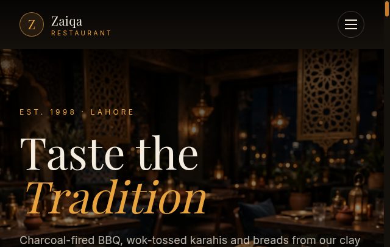

  <h1>Zaiqa Restaurant</h1>
  
<b>Restaurant website with digital menu, PKR pricing &amp; table reservations.</b>

  

    
    
    
    
  

 

  

 

<h2>About</h2>

An appetizing restaurant website — browse the menu, filter by category, and book a table. Warm design, fully responsive.

<h2>Features</h2>

<ul>
  <li>15 dishes with PKR pricing</li>
  <li>Category filters &amp; search</li>
  <li>Spice level indicators</li>
  <li>Table reservation form</li>
  <li>Fully responsive design</li>
</ul>

<h2>Tech Stack</h2>

Next.js 14 · React · TypeScript · Tailwind CSS · Vercel

<h2>Developed by</h2>

<b>iquism</b> — <a href="https://iquism-portfolio.vercel.app">https://iquism-portfolio.vercel.app</a>

